- 👋 Hi, my name is Rogier
- 👀 I’m interested in Golang, Platform engineering and beekeeping
- 🌱 I love working with Go, most of my private projects are in this language at this moment.
- 📫 How to reach me: Check out linkedin or my website: https://0to1.nl
- 💻 Freelance per 2022!

 

